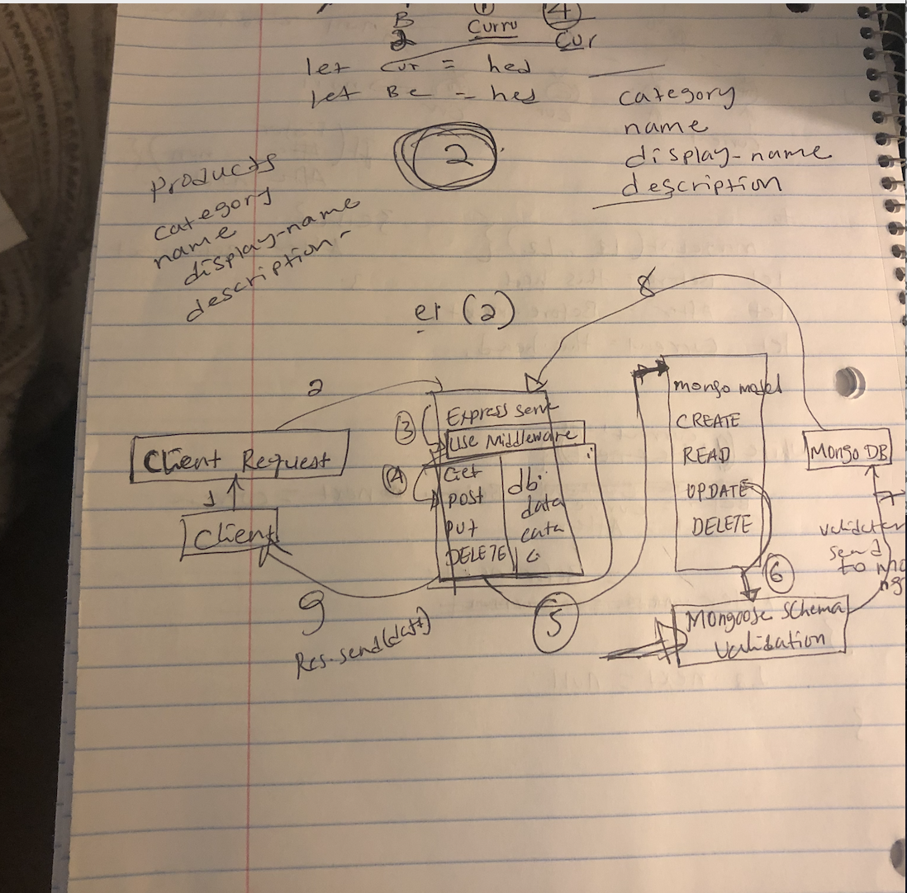

# Lab 08 — Express Routing & Connected API

## Project Name : Lab 08 — Express Routing & Connected API

### Author: Henok Gebremedhn

### Links and Resources

- [submission PR](https://github.com/henok-401-javascript/lab-07-Express/pull/4)

### DOCUMENTATION

[Swagger Hub](http://localhost:3000/api-docs)
[heroku](https://lab-07-express.herokuapp.com/)

### Setup

#### `.env` requirements (where applicable)

- `PORT` - json-server --watch ./data/db.json

#### How to initialize/run your application (where applicable)

- mongod --dbpath ./data/db // to start my mongoDB locally
- EndPoint:'/1'
  return By Id of 1.
- EndPoing:'/categories'
  return by all the categoryListed from the inventory.
- EndPoing:'/products'  
   return by all the productsSchema from the inventory.

#### Tests

- unit tests: 'npm test'
- lint test: 'npm run lint'

#### UML

